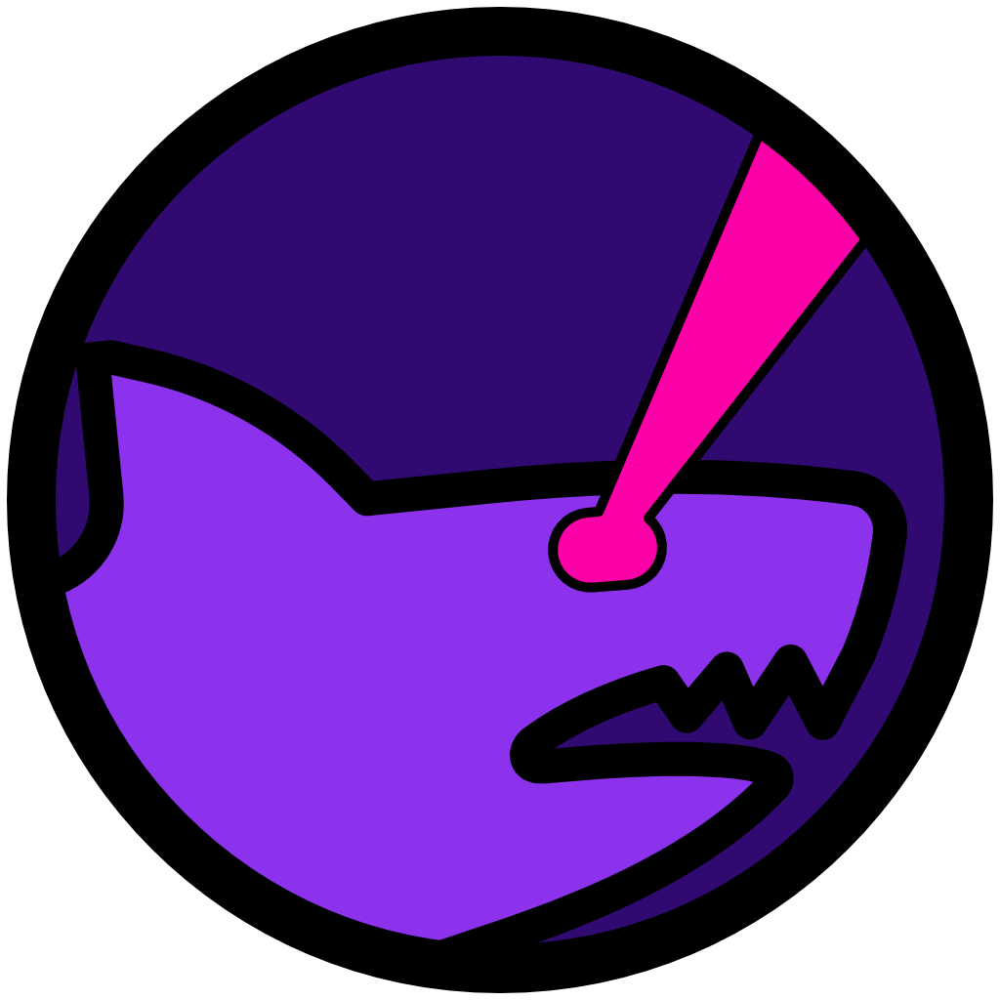
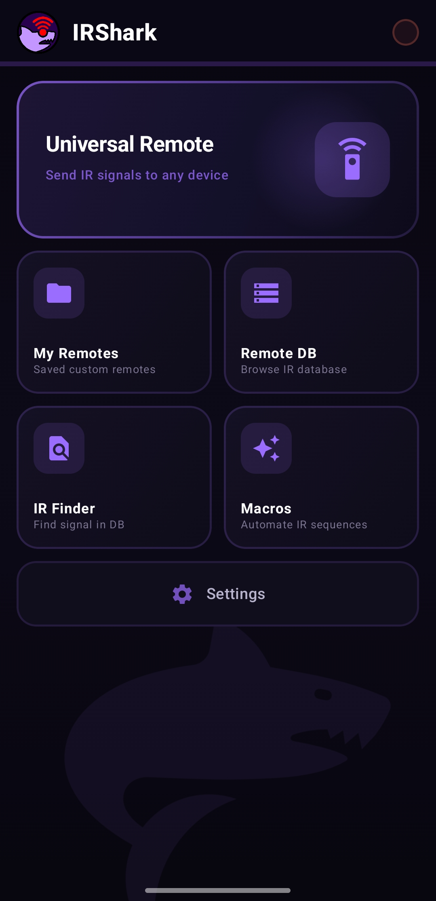
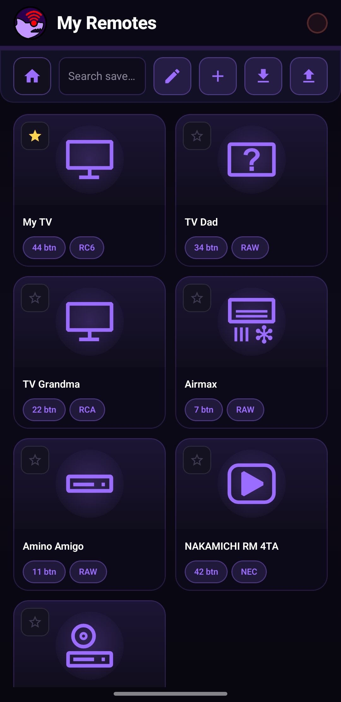
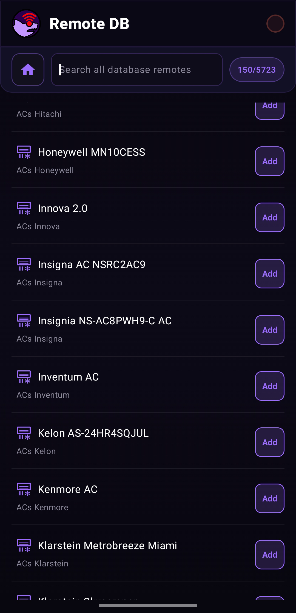
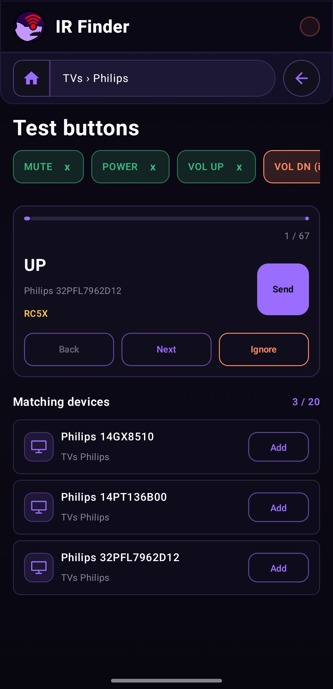
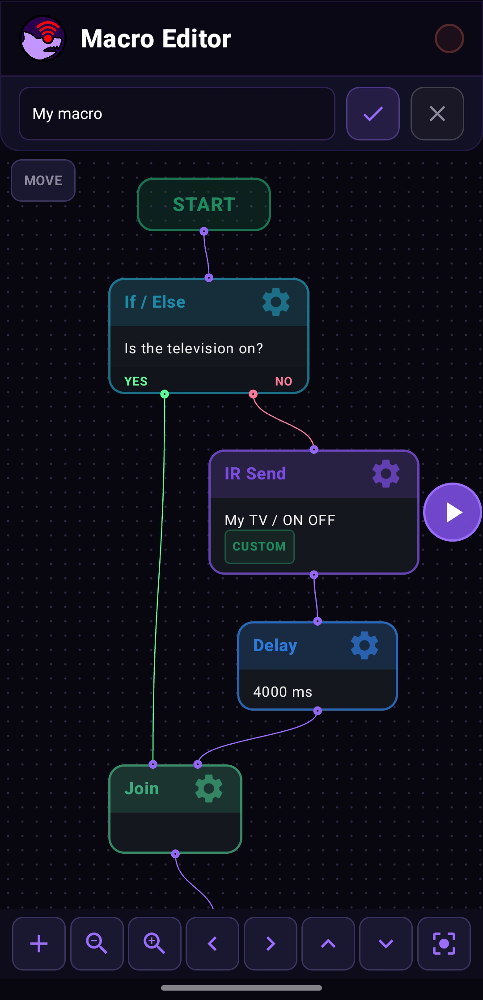

<p align="center">
  
</p>

<h1 align="center">IRShark</h1>

<p align="center">
  Android app for IR device control, testing codes from the Flipper IRDB, and building custom automation macros.
</p>

<p align="center">
  
  
  
  
  
  
  
</p>

## 📱 About

IRShark is a practical IR remote toolbox for Android. It helps you:

- control devices via your phone's built-in IR blaster
- use a large profile database from Flipper IRDB
- test compatible codes step by step (IR Finder)
- save your own remotes and button layouts
- build macros (automated IR command sequences)

The project is designed as a practical-first tool: fast signal sending, clear profile navigation, and a smooth workflow for real-world hardware testing.

## 📡 Supported IR Protocols

IRShark currently encodes and transmits these parsed protocols:

- NEC
- NECext
- NEC42
- Samsung
- Samsung32
- RC5
- RC5X
- RC6
- SIRC (12-bit)
- SIRC15
- SIRC20
- Kaseikyo
- RCA
- Pioneer

It also supports RAW timing payloads.

## 🐬 Flipper IR DB

IRShark uses a bundled Flipper IRDB copy in assets:

- Community repository: https://github.com/Lucaslhm/Flipper-IRDB

This gives the app broad brand/device coverage without manual code entry.

## 🧭 App Sections

Main sections in the app:

- Universal Remote: quickly sends common commands across multiple profiles in a category
- My Remotes: your saved remotes, custom button mappings, favorites
- Remote DB: browse the built-in IR profile database
- Remote Control: control screen for a specific remote
- IR Finder: guided workflow to find working codes based on device response
- Macro Editor: create/edit block-based command sequences

## ✨ Key Features

- protocol label shown directly on remote buttons
- protocol shown in the macro transmission table during runtime
- import/export support for remote and macro JSON files
- category-based navigation with device icons
- haptic feedback and visual TX activity indicator

## 🖼️ Screenshots

<p align="center">
  
  
  
</p>

<p align="center">
  
  
  
</p>

## 🛠️ Tech Stack

- Kotlin + Jetpack Compose
- Material 3
- Gradle Kotlin DSL
- Android ConsumerIrManager for IR transmission

## 🚀 Build & Run

Requirements:

- Android Studio (recent version with Compose support)
- Android SDK 36
- Minimum supported runtime: Android 8.0+ (API 26)
- a device with an IR blaster for real transmission

> Most emulators do not expose `ConsumerIrManager`. For real transmission testing use a physical device with an IR emitter (e.g. Xiaomi, OPPO, some Samsung models).

```bash
./gradlew :app:compileDebugKotlin   # compile check
./gradlew :app:installDebug         # build + install on connected device
./gradlew :app:assembleDebug        # build debug APK
./gradlew :app:assembleRelease      # build release APK
```

## 🤝 Contributing

Contributions are welcome! Here is how to get started and what to keep in mind when opening a pull request.

### Getting the code

```bash
git clone https://github.com/vexdev/IRShark.git
cd IRShark
```

Open the project root in Android Studio (`File → Open`). Gradle syncs automatically on first open.

### Codebase overview

| Area | Where to look |
|---|---|
| Navigation & screen state | `MainActivity.kt` |
| Screen composables | `ui/screens/` |
| Shared UI components | `ui/components/` |
| IR protocol encoders | `ir/` |
| Profile parsing & DB index | `data/IrRepository.kt` |
| Data models | `model/` |
| Dependency versions | `gradle/libs.versions.toml` |

### Branch naming

Use a short, lowercase, hyphen-separated name that describes what the branch does:

```
feat/rc6-protocol
fix/db-cache-regression
ui/button-editor-header
chore/bump-compose-bom
```

| Prefix | Use for |
|---|---|
| `feat/` | new feature or protocol support |
| `fix/` | bug fix |
| `ui/` | visual / UX change with no functional impact |
| `chore/` | dependency bumps, refactors, build changes |
| `docs/` | documentation only |

### Pull request guidelines

- **One concern per PR.** Don't mix a bug fix with a refactor — open separate PRs.
- **Title format:** `[prefix] short description in present tense`
  - ✅ `[feat] Add RC6 protocol encoder`
  - ✅ `[fix] Restore DB cache fast-path on startup`
  - ❌ `Various improvements and fixes`
- **Description should include:**
  - What the PR does and why
  - How to test it (which screen / device / flow to exercise)
  - Screenshots or a short screen recording for UI changes
- Keep the diff focused — avoid reformatting unrelated files.
- Make sure `./gradlew :app:compileDebugKotlin` passes before opening the PR.

### Adding a new IR protocol

1. Add an encoder in `app/src/main/java/com/vex/irshark/ir/`.
2. Register the protocol name in the `encode()` dispatcher (same package).
3. Add the protocol name to the supported list in this README.

### Adding a new screen

1. Add a value to the `Screen` enum in `MainActivity.kt`.
2. Add the screen title to the `screenTitle` map.
3. Add the composable call to the `when (screen)` block in `MainContent`.
4. If the screen needs top-bar navigation, include its `Screen` value in the `navBarScreens` set.

## 🧪 Usage Notes

- some commands may need repeats or a longer press depending on device behavior
- real-world compatibility depends on the quality of your phone's IR emitter
- for reliable validation, test both decode output (e.g. with Flipper) and real target-device response

## 🗂️ Dataset — Flipper IR Database Format

IRShark reads IR profiles in the **Flipper Zero `.ir` format**. Both the bundled database and any user-imported ZIP archive must follow this structure.

### Directory structure

```
flipper_irdb/
├── TVs/
│   ├── Samsung/
│   │   ├── Samsung_TV_Full.ir
│   │   └── Samsung_UN60JU6500_Discrete.ir
│   └── Sony/
│       └── Sony_RM_ED045.ir
├── ACs/
│   └── LG/
│       └── LG_AC.ir
├── Projectors/
│   └── Epson/
│       └── Epson_EH_TW5650.ir
└── ...
```

**Level 1 — device type folder** (e.g. `TVs`, `ACs`, `Projectors`, `Fans`, `Speakers`, …)  
**Level 2 — brand folder** (e.g. `Samsung`, `Sony`, `LG`, …)  
**Level 3 — `.ir` files**, one per remote model

The app scans recursively, so deeper nesting (e.g. sub-brand folders) is also supported.

---

### `.ir` file format

Every `.ir` file is a plain-text file. The first two lines are a mandatory header:

```
Filetype: IR signals file
Version: 1
```

After the header, the file contains one or more **signal blocks** separated by `#` comment lines. Each block defines a single button/command.

---

#### Signal block — parsed type

Used for known protocols where the remote code can be expressed as address + command bytes:

```
name: Power
type: parsed
protocol: NECext
address: EE 87 00 00
command: 5D AA 00 00
```

| Field | Description |
|---|---|
| `name` | Button label. Words separated by `_` (displayed as spaces in the app). |
| `type` | Must be `parsed`. |
| `protocol` | IR protocol name. Supported: `NEC`, `NECext`, `NEC42`, `Samsung`, `Samsung32`, `RC5`, `RC5X`, `RC6`, `SIRC`, `SIRC15`, `SIRC20`, `Kaseikyo`, `RCA`, `Pioneer`. |
| `address` | Address bytes in hex, space-separated, LSB first (e.g. `EE 87 00 00`). |
| `command` | Command bytes in hex, space-separated, LSB first (e.g. `5D AA 00 00`). |

---

#### Signal block — raw type

Used when the exact protocol is unknown or non-standard. The signal is stored as a sequence of on/off pulse durations in microseconds:

```
name: Power
type: raw
frequency: 38000
duty_cycle: 0.330000
data: 1278 408 1276 410 437 1250 434 1253 ...
```

| Field | Description |
|---|---|
| `name` | Button label. |
| `type` | Must be `raw`. |
| `frequency` | Carrier frequency in Hz (typically `38000`). |
| `duty_cycle` | Carrier duty cycle as a decimal (typically `0.330000`). |
| `data` | Space-separated list of pulse/gap durations in microseconds. Values alternate: on, off, on, off, … |

---

#### Complete example — one file with two signals

```
Filetype: IR signals file
Version: 1
#
name: Power
type: parsed
protocol: NEC
address: 00 00 00 00
command: 08 F7 00 00
#
name: Vol_up
type: raw
frequency: 38000
duty_cycle: 0.330000
data: 9042 4484 620 532 620 532 620 1658 620 532 620 532 620 532 620 532 620 532 620 1658 620 1658 620 532 620 1658 620 1658 620 1658 620 1658 620 1658 620 532 620 532 620 532 620 1658 620 532 620 532 620 532 620 532 620 1658 620 1658 620 1658 620 1658 620 532 620 1658 620 1658 620 1658 620 39784
```

---

### Importing a custom database

In **Settings → Database**, tap **Import database ZIP**. The ZIP must contain a `flipper_irdb/` root directory matching the structure above. The app validates that at least one `.ir` file is present before accepting the archive.

## 🗂️ Project Structure

- app
: Android app source code
- app/src/main/assets/flipper_irdb
: local copy of the Flipper IR database
- gradle, build skripty
: build configuration

## 📄 License

- IRShark application code is licensed under the PolyForm Noncommercial License 1.0.0.
- Commercial use of the application code is not allowed without separate permission from the author.
- License scope applies only to the IRShark application project files.
- The bundled Flipper IRDB dataset is licensed separately by its upstream project and is not re-licensed by this repository.

See:

- LICENSE (project root)
- app/src/main/assets/flipper_irdb/LICENSE
- https://github.com/Lucaslhm/Flipper-IRDB

