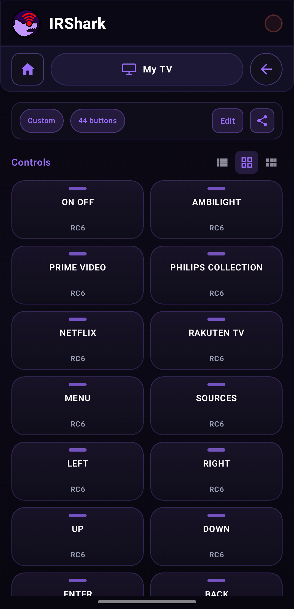
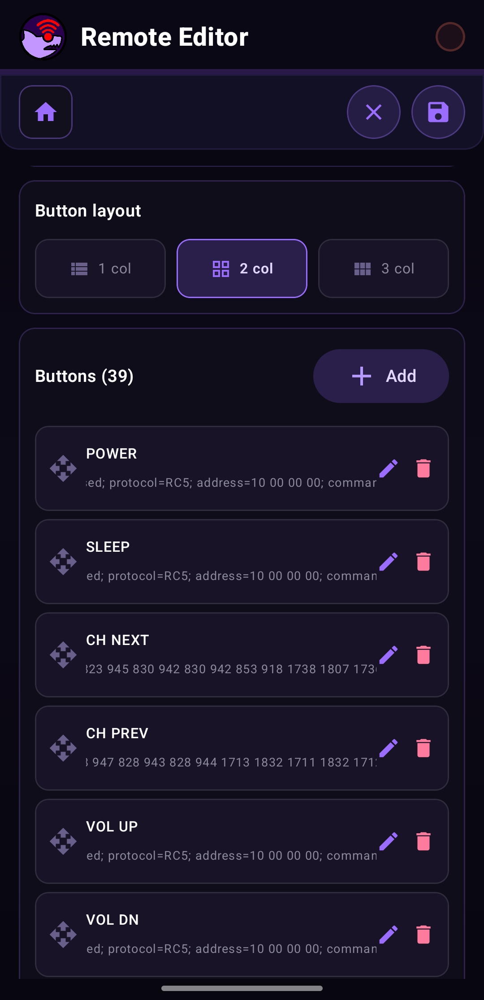
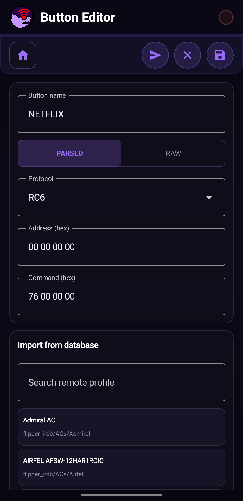
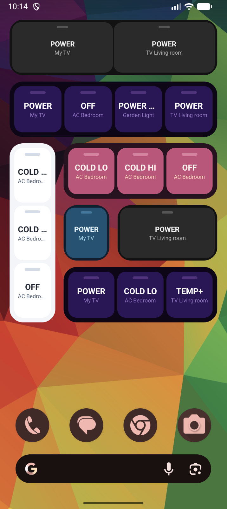

<p align="center">
  
</p>

<h1 align="center">IRShark</h1>

<p align="center">
  Android app for IR device control, testing codes from the Flipper IRDB, and building custom automation macros.
</p>

<p align="center">
  
  
  
  
  
  
  
</p>

## 📱 About

IRShark is a practical IR remote toolbox for Android. It helps you:

- control devices via your phone's built-in IR blaster
- use a large profile database from Flipper IRDB
- test compatible codes step by step (IR Finder)
- save your own remotes and button layouts
- build macros (automated IR command sequences)

The project is designed as a practical-first tool: fast signal sending, clear profile navigation, and a smooth workflow for real-world hardware testing.

## 📡 Supported IR Protocols

<p align="left">
  
  
  
  
  
  
  
  
  
  
  
  
  
  
  
  
  
  
  
</p>

## 🐬 Flipper IR DB

IRShark uses a bundled Flipper IRDB copy in assets:

- Community repository: https://github.com/Lucaslhm/Flipper-IRDB

This gives the app broad brand/device coverage without manual code entry.

## 🧭 App Sections

Main sections in the app:

- Universal Remote: quickly sends common commands across multiple profiles in a category
- My Remotes: your saved remotes, custom button mappings, favorites
- Remote DB: browse the built-in IR profile database
- Remote Control: control screen for a specific remote
- IR Finder: guided workflow to find working codes based on device response
- Macro Editor: create/edit block-based command sequences

## 🖼️ Screenshots

<p align="center">
  
  
  
</p>

<p align="center">
  
  
  
</p>

Remote Editor supports clear, structured editing of both whole remotes and individual IR payload codes sent by each button.

<p align="center">
  
  
</p>

### Widget Preview

IRShark also includes a home screen widget for quick access to saved IR actions without opening the full app.

<p align="center">
  
</p>

## 🛠️ Tech Stack

- Kotlin + Jetpack Compose
- Material 3
- Gradle Kotlin DSL
- Android ConsumerIrManager for IR transmission

## 🚀 Build & Run

Requirements:

- Android Studio (recent version with Compose support)
- Android SDK 36
- Minimum supported runtime: Android 8.0+ (API 26)
- a device with an IR blaster for real transmission

> Most emulators do not expose `ConsumerIrManager`. For real transmission testing use a physical device with an IR emitter (e.g. Xiaomi, OPPO, some Samsung models).

```bash
./gradlew :app:compileDebugKotlin   # compile check
./gradlew :app:installDebug         # build + install on connected device
./gradlew :app:assembleDebug        # build debug APK
./gradlew :app:assembleRelease      # build release APK
```

## 🧪 Usage Notes

- some commands may need repeats or a longer press depending on device behavior
- real-world compatibility depends on the quality of your phone's IR emitter
- for reliable validation, test both decode output (e.g. with Flipper) and real target-device response

## 🤝 Contributing

Contributions are welcome! Here is how to get started and what to keep in mind when opening a pull request.

### Getting the code

```bash
git clone https://github.com/vexdev/IRShark.git
cd IRShark
```

Open the project root in Android Studio (`File → Open`). Gradle syncs automatically on first open.

### Branch naming

Use a short, lowercase, hyphen-separated name that describes what the branch does:

```
feat/rc6-protocol
fix/db-cache-regression
ui/button-editor-header
chore/bump-compose-bom
```

| Prefix | Use for |
|---|---|
| `feat/` | new feature or protocol support |
| `fix/` | bug fix |
| `ui/` | visual / UX change with no functional impact |
| `chore/` | dependency bumps, refactors, build changes |
| `docs/` | documentation only |

### Pull request guidelines

- **One concern per PR.** Don't mix a bug fix with a refactor — open separate PRs.
- **Title format:** `[prefix] short description in present tense`
  - ✅ `[feat] Add RC6 protocol encoder`
  - ✅ `[fix] Restore DB cache fast-path on startup`
  - ❌ `Various improvements and fixes`
- **Description should include:**
  - What the PR does and why
  - How to test it (which screen / device / flow to exercise)
  - Screenshots or a short screen recording for UI changes
- Keep the diff focused — avoid reformatting unrelated files.
- Make sure `./gradlew :app:compileDebugKotlin` passes before opening the PR.

## 📄 License

- IRShark application code is licensed under the PolyForm Noncommercial License 1.0.0.
- Commercial use of the application code is not allowed without separate permission from the author.
- License scope applies only to the IRShark application project files.
- The bundled Flipper IRDB dataset is licensed separately by its upstream project and is not re-licensed by this repository.

See:

- LICENSE (project root)
- app/src/main/assets/flipper_irdb/LICENSE
- https://github.com/Lucaslhm/Flipper-IRDB

